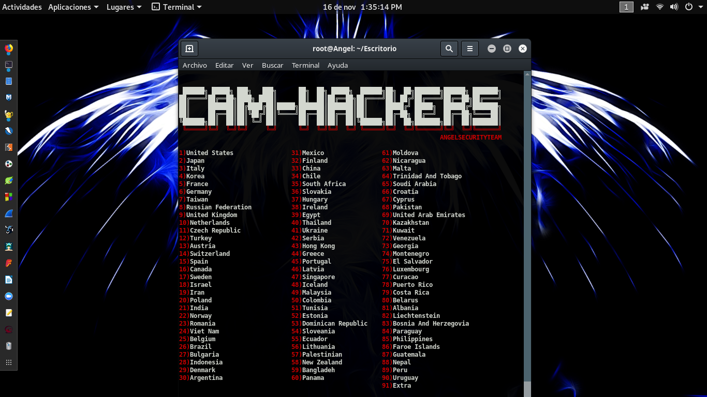
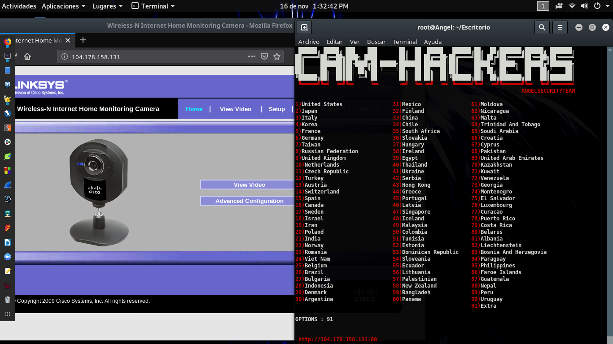

# Cam-Hackers

Hack Cameras

### Usage

<strong>Linux</strong>
* apt-get install python3
* apt-get install git
* git clone https://github.com/AngelSecurityTeam/Cam-Hackers
* cd Cam-Hackers
* pip install -r requirements.txt
* python3 cam_hackers.py

<strong>Windows</strong>
* git clone https://github.com/AngelSecurityTeam/Cam-Hackers
* cd Cam-Hackers
* pip install -r requirements.txt
* python3 cam_hackers.py

<strong>As a library</strong>
* `import cam_hackers`
* `cam_hackers.scrape("countrycode")`

* Example:
```python
import cam_hackers

for ip in cam_hackers.scrape("NL"):
    print(ip)
```

### Images





### Paypal donations

* https://www.paypal.com/paypalme/AngelSecTeam